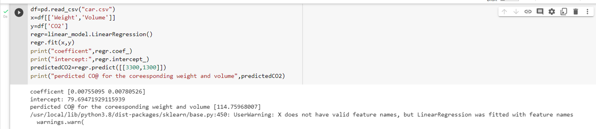

# Implementation of Multivariate Linear Regression
## Aim
To write a python program to implement multivariate linear regression and predict the output.
## Equipment’s required:
1.	Hardware – PCs
2.	Anaconda – Python 3.7 Installation / Moodle-Code Runner
## Algorithm:
### Step1
Import Pandas library and linear_model from sklearn using import statement.


### Step2
Read the given csv file using read_csv() method.

### Step3
Create two arrays, independent array x with two classes and dependent array y with one class. Find the regression of x and y using linear_model.LinearRegression() method and fit x and y usind .fit() method.

### Step4
Find the coefficients using .coef_ and intercept using .intercept.

### Step5
Predict the liner regression using regr.predict() method and display the result.

## Program:
```py
# Developed by : Shalini
# Reference no: 22009257


import pandas as pd
from sklearn import linear_model
df=pd.read_csv("car.csv")
x=df[['Weight','Volume']]
y=df['CO2']
regr=linear_model.LinearRegression()
regr.fit(x,y)
print("Cofficient:",regr.coef_)
print("Intercept:",regr.intercept_)
predicatedCO2=regr.predict([[3300,1300]])
print("predicated CO@ for the corresponding weight and volume",predicatedCO2)
```
## Output:




## Result
Thus the multivariate linear regression is implemented and predicted the output using python program.